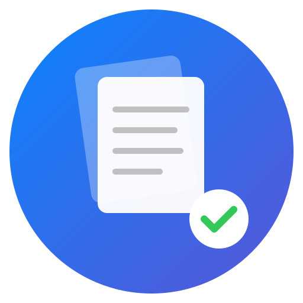

# Transport

Eine minimalistische Electron-App zum schnellen Erfassen von Gedanken mit automatischer Verarbeitung beim "Transport" zu konfigurierbaren Zielorten.



## Features

- **Sofort lostippen** - Öffnet sich mit leerem Blatt, bereit für deine Gedanken
- **Grammatikkorrektur** - Automatische Rechtschreib- und Grammatikprüfung via LanguageTool
- **Flexible Zielorte** - Konfiguriere beliebig viele Ordner als Ziele
- **Tags** - Füge vordefinierte Tags per Dropdown hinzu
- **YAML-Frontmatter** - Automatisch generierter Header mit Titel, Datum und Tags
- **Markdown** - Alle Notizen werden als `.md` Dateien gespeichert
- **Konfigurierbares Dateiformat** - z.B. `202601270901 - Meine Notiz.md`

## Installation

### macOS

Lade die passende Version für deinen Mac herunter:

- **Apple Silicon (M1/M2/M3)**: `Transport-1.0.0-arm64.dmg`
- **Intel Mac**: `Transport-1.0.0-x64.dmg`

Öffne die DMG-Datei und ziehe Transport in den Programme-Ordner.

### Linux

- **AppImage**: `Transport-1.0.0.AppImage`
- **Debian/Ubuntu**: `Transport-1.0.0.deb`

## Entwicklung

### Voraussetzungen

- Node.js 18+
- npm

### Setup

```bash
# Repository klonen
git clone https://github.com/jochenleeder/transport.git
cd transport

# Abhängigkeiten installieren
npm install

# Icons generieren
node scripts/generate-icons.js

# App starten
npm start
```

### Build

```bash
# macOS Build
npm run build:mac

# Linux Build
npm run build:linux
```

## Konfiguration

Die Konfiguration wird unter `~/.config/transport/config.json` gespeichert:

```json
{
  "destinations": [
    { "name": "Inbox", "path": "/Users/name/Notes/Inbox" }
  ],
  "tags": ["idee", "todo", "frage", "wichtig"],
  "addTimestamp": true,
  "filenameFormat": "{timestamp} - {title}",
  "languageTool": {
    "enabled": true,
    "apiUrl": "https://api.languagetool.org/v2/check",
    "language": "de-DE"
  }
}
```

### Dateiname-Format

- `{timestamp}` - Zeitstempel im Format YYYYMMDDHHMM (z.B. 202601270901)
- `{title}` - Erste Zeile des Textes

## Verwendung

1. **Schreiben** - Öffne Transport und beginne sofort zu tippen
2. **Transportieren** - Klicke auf "Transport" und wähle:
   - Zielort (konfigurierte Ordner)
   - Tags (optional)
   - Zeitstempel im YAML-Header (optional)
3. **Fertig** - Deine Notiz wird als Markdown-Datei gespeichert

### Beispiel-Output

```markdown
---
title: "Teamabstimmung morgen"
date: 2026-01-27T09:01:00
tags:
  - todo
  - wichtig
---

Die Teamabstimmung morgen um 10 Uhr nicht vergessen.
Agenda vorbereiten!
```

## Lizenz

MIT License - siehe [LICENSE](LICENSE)

## Autor

Jochen Leeder
